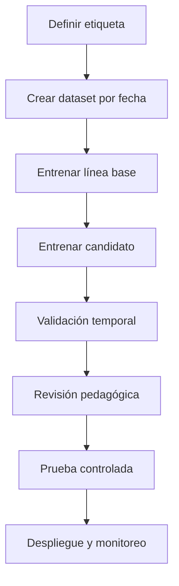

# Supervised_LMs

Esta carpeta reúne la documentación de los escenarios de **Machine Learning supervisado** de Tutunaku. Un modelo supervisado aprende a partir de ejemplos históricos que incluyen variables de entrada y un resultado conocido llamado **etiqueta** o **variable objetivo**.

Ejemplo: para predecir abandono, cada registro contiene la actividad histórica del usuario y una etiqueta que indica si permaneció inactivo durante los siguientes 14 días.

## 1. Objetivo

Desarrollar modelos que ayuden a anticipar resultados educativos, de gamificación y técnicos para ejecutar acciones útiles dentro de Tutunaku.

Los modelos de esta carpeta deben:

- Empezar con una línea base sencilla.
- Utilizar etiquetas reproducibles.
- Evitar información futura.
- Evaluarse con datos separados por tiempo y usuario.
- Generar razones o variables explicativas.
- Producir recomendaciones reversibles y no sanciones automáticas.

## 2. Archivos actuales

```text
Supervised_LMs/
├── README.md
└── translation_model_notes.md
```

### `translation_model_notes.md`

Documento de trabajo para registrar decisiones relacionadas con traducción y clasificación de respuestas: objetivo, categorías de error, preprocesamiento, respuestas aceptadas, variantes, algoritmo, métricas y pruebas.

No debe contener datos personales ni audios reales. Los resultados definitivos deben integrarse en este README o en la documentación formal de cada versión.

## 3. Escenarios supervisados

### S01. Predicción de deserción del estudiante

**Pregunta:** ¿qué usuarios activos podrían permanecer 14 días consecutivos sin utilizar Tutunaku?

| Elemento | Definición |
|---|---|
| Tipo | Clasificación binaria |
| Etiqueta | `churn_14d`: 1 si no existe actividad en los siguientes 14 días |
| Variables | Recencia, sesiones, racha, XP, nivel, vidas, fallos, lecciones y juegos |
| Línea base | Regla de días de inactividad y Regresión Logística |
| Candidato | Random Forest o Gradient Boosting |
| Métricas | PR-AUC, recall, precision@k, lift y Brier score |
| Acción | Recordatorio amable, repaso corto o recuperación de racha |

Control: no confundir conectividad limitada con falta de interés y no retirar XP, vidas o logros.

### S02. Estimación del tiempo de respuesta

**Pregunta:** ¿cuántos segundos necesitará un estudiante para responder un ejercicio?

| Elemento | Definición |
|---|---|
| Tipo | Regresión |
| Objetivo | `time_spent_seconds` sin tiempo de red ni pestaña inactiva |
| Variables | Tipo, dificultad, historial, intentos, pistas, nivel, dispositivo y modalidad |
| Línea base | Mediana por tipo y dificultad |
| Candidato | Random Forest Regressor o Gradient Boosting por cuantiles |
| Métricas | MAE, RMSE y cobertura del intervalo p10-p90 |
| Acción | Ajustar temporizador, pista o pausa |

Control: el tiempo estimado no debe reducir automáticamente calificación, XP o vidas.

### S03. Clasificación de pronunciación por voz

**Pregunta:** ¿la pronunciación es adecuada, aproximada o necesita práctica?

| Elemento | Definición |
|---|---|
| Tipo | Clasificación multiclase |
| Etiqueta | `Adecuada`, `Aproximada`, `Requiere_practica` |
| Variables | Espectrograma, MFCC, embedding, palabra, fonema, duración y variante |
| Línea base | Similitud coseno o DTW contra audio de referencia |
| Candidato | SVM sobre embeddings o CNN ligera |
| Métricas | Macro F1, recall por variante, matriz de confusión y calibración |
| Acción | Mostrar ejemplo nativo y segmento a reforzar |

Control: requiere consentimiento, separación por hablante y validación de especialistas. Nunca debe identificar a la persona por su voz.

### S04. Predicción de la calificación de una lección

**Pregunta:** ¿qué puntuación podría obtener el usuario antes de iniciar una lección?

| Elemento | Definición |
|---|---|
| Tipo | Regresión |
| Objetivo | `score` de 0 a 100 |
| Variables | Historial, precisión por tema, tiempo, intentos, dificultad, nivel, racha y vidas |
| Línea base | Promedio del usuario y promedio de la lección |
| Candidato | Random Forest Regressor o Gradient Boosting |
| Métricas | MAE, RMSE y error en usuarios sin historial |
| Acción | Recomendar avance, repaso o experiencia preparatoria |

Control: no mostrar un puntaje negativo anticipado ni impedir que el usuario avance.

### S05. Detección de errores gramaticales

**Pregunta:** ¿qué tipo de error aparece en una respuesta escrita o traducción?

| Elemento | Definición |
|---|---|
| Tipo | Clasificación multiclase o multietiqueta |
| Clases | Vocabulario, orden, morfología, escritura, significado, variante válida y otro |
| Variables | Respuesta, solución esperada, alternativas, tema, idioma y variante |
| Línea base | Reglas y distancia de edición |
| Candidato | Regresión Logística/Naive Bayes con n-gramas o Transformer ligero |
| Métricas | Macro F1, recall por clase y top-2 accuracy |
| Acción | Mostrar explicación y microejercicio específico |

Control: las respuestas aceptadas deben estar versionadas y una variante legítima no debe etiquetarse como error.

### S06. Predicción de éxito en juegos, experiencias y retos

**Pregunta:** ¿el usuario completará una actividad con el puntaje esperado y al menos una vida restante?

| Elemento | Definición |
|---|---|
| Tipo | Clasificación binaria |
| Etiqueta | `success`: finalización + umbral de puntaje + vidas disponibles |
| Variables | Nivel, XP, vidas, racha, actividad reciente, dificultad y resultados similares |
| Línea base | Tasa histórica por actividad y nivel |
| Candidato | Regresión Logística o Gradient Boosting calibrado |
| Métricas | PR-AUC, ROC-AUC y Brier score |
| Acción | Ofrecer práctica previa, ajustar reto o recomendar alternativa |

Control: evitar presión compulsiva; las recompensas deben ser claras y educativas.

### S07. Recomendación del nivel inicial

**Pregunta:** ¿el usuario debe comenzar en nivel Principiante, Intermedio o Avanzado?

| Elemento | Definición |
|---|---|
| Tipo | Clasificación multiclase |
| Etiqueta | Nivel confirmado por desempeño en las primeras tres lecciones |
| Variables | Respuestas, tema, dificultad, tiempo, pistas y experiencia previa opcional |
| Línea base | Puntaje con cortes pedagógicos |
| Candidato | Árbol de Decisión, Random Forest o KNN |
| Métricas | Macro F1, balanced accuracy y error adyacente |
| Acción | Asignar ruta inicial con opción de cambiarla |

Control: el nivel es una recomendación temporal, no una etiqueta permanente de capacidad.

### S08. Estimación de carga de la plataforma

**Pregunta:** ¿cuántas peticiones y sesiones habrá en los siguientes 15 o 60 minutos?

| Elemento | Definición |
|---|---|
| Tipo | Regresión temporal |
| Objetivos | Peticiones/minuto, sesiones activas, latencia p95 y conexiones |
| Variables | Hora, día, rezagos, despliegues, torneos, notificaciones y caché |
| Línea base | Promedio móvil y patrón por hora/día |
| Candidato | Gradient Boosting con rezagos; LSTM solo si mejora la línea base |
| Métricas | MAE, WAPE, error en picos y cobertura de intervalos |
| Acción | Escalar servicios, ajustar caché o mover mantenimiento |

Control: no registrar contenido personal en logs y limitar el autoescalamiento inestable.

### S09. Clasificación de dificultad real

**Pregunta:** ¿un ejercicio es Fácil, Medio o Difícil según su comportamiento real?

| Elemento | Definición |
|---|---|
| Tipo | Clasificación multiclase |
| Etiqueta | Dificultad revisada por especialistas |
| Variables | Fallos, tiempo, abandono, intentos, pistas, vidas y modalidad |
| Línea base | Reglas de tasa de fallo y tiempo |
| Candidato | Random Forest, SVM o Gradient Boosting |
| Métricas | Macro F1, balanced accuracy y Cohen kappa |
| Acción | Reordenar, agregar pista, cambiar XP o rediseñar |

Control: una tasa alta de fallo puede representar un audio defectuoso o una pregunta ambigua, no dificultad.

### S10. Predicción de adquisición de logros

**Pregunta:** ¿qué probabilidad tiene un usuario elegible de obtener un logro en 30 días?

| Elemento | Definición |
|---|---|
| Tipo | Clasificación y estimación agregada |
| Etiqueta | `acquired_30d` |
| Variables | XP, nivel, racha, progreso de condición, misiones, juegos y experiencias |
| Línea base | Porcentaje histórico entre usuarios elegibles |
| Candidato | Regresión Logística, Random Forest o XGBoost |
| Métricas | PR-AUC, Brier score y error del porcentaje agregado |
| Acción | Ajustar condición, recompensa o crear metas intermedias |

Control: no reducir logros ya obtenidos y mantener condiciones transparentes.

## 4. Flujo de desarrollo



## 5. Estructura recomendada por escenario

Cuando se agregue código, cada escenario puede organizarse así:

```text
Supervised_LMs/
└── S01_churn/
    ├── README.md
    ├── config.yaml
    ├── train.py
    ├── evaluate.py
    ├── predict.py
    ├── features.py
    ├── tests/
    └── artifacts/
        ├── metrics.json
        ├── feature_schema.json
        └── model_card.md
```

Los archivos binarios pesados y datasets personales deben guardarse en almacenamiento seguro, no directamente en Git.

## 6. Plantilla de configuración

```yaml
scenario_id: S01
model_name: churn_logistic_regression
model_version: 1.0.0
prediction_unit: user_day
cutoff_column: feature_timestamp
target: churn_14d
baseline: inactivity_rule
algorithm: logistic_regression
primary_metric: pr_auc
split_strategy: temporal_by_user
random_state: 42
```

## 7. Validación mínima

- Comparar el candidato contra una línea base.
- Reservar un conjunto de prueba temporal.
- Mantener el mismo usuario fuera de periodos futuros cuando corresponda.
- Reportar resultados generales y por grupos con muestra suficiente.
- Medir calibración cuando se devuelvan probabilidades.
- Evaluar el impacto de la acción, no solo la métrica del modelo.
- Definir un mecanismo de respaldo si el modelo falla.

## 8. Contrato de predicción

Respuesta recomendada desde FastAPI:

```json
{
  "prediction_id": "uuid",
  "scenario_id": "S01",
  "generated_at": "2026-08-13T20:00:00Z",
  "target_horizon": "14d",
  "score": 0.81,
  "predicted_class": "high_risk",
  "confidence": 0.76,
  "reason_codes": ["low_recent_activity", "streak_broken"],
  "recommended_action": "short_review_activity",
  "model_version": "1.0.0",
  "expires_at": "2026-08-14T20:00:00Z"
}
```

## 9. Métricas y uso

| Métrica | Uso |
|---|---|
| Accuracy | Solo cuando las clases están razonablemente equilibradas |
| Precision | Cuando un falso positivo genera una intervención costosa |
| Recall | Cuando es importante encontrar la mayoría de casos positivos |
| F1 macro | Cuando todas las clases deben tener el mismo peso |
| PR-AUC | Clasificación con pocos positivos |
| Brier score | Calidad de probabilidades y calibración |
| MAE | Error medio interpretable de regresión |
| RMSE | Penaliza errores grandes |
| WAPE | Series con valores cercanos a cero |

## 10. Criterios de producción

Un modelo no se considera listo solo por entrenar correctamente. Debe cumplir:

- Mejora frente a la línea base.
- Datos y etiqueta documentados.
- Prueba temporal sin fuga de información.
- Métricas aceptables y estables.
- Revisión pedagógica/cultural cuando aplique.
- Latencia compatible con el punto de uso.
- Fallback cuando el modelo no esté disponible.
- Monitoreo de drift y calidad de datos.
- Plan de rollback.
- Evidencia de valor mediante prueba A/B o revisión controlada.

## 11. Navegación

- [Volver a DataModels](../README.md)
- [Volver al README principal](../../README.md)
- [Notas del modelo de traducción](./translation_model_notes.md)
- [Documentación de API](../../Docs/API.md)

