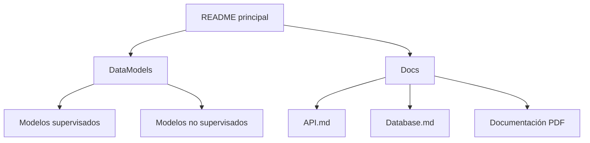
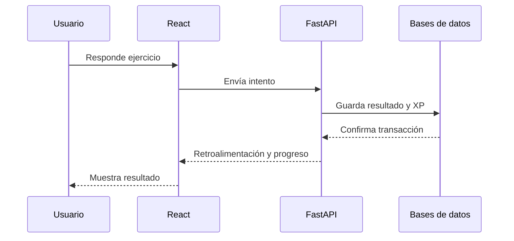

# Docs

Esta carpeta concentra la documentación técnica y funcional del proyecto **Tutunaku**. Su propósito es ayudar a estudiantes, desarrolladores, responsables de datos, administradores y especialistas a comprender el sistema sin depender únicamente del código fuente.

La documentación debe actualizarse cuando cambie la API, el esquema de base de datos, la arquitectura, las reglas de gamificación o los modelos de Machine Learning.

## 1. Contenido

```text
Docs/
├── README.md
├── API.md
├── Database.md
└── Tutunaku-Documentación.pdf
```

| Archivo | Propósito | Responsable sugerido |
|---|---|---|
| [`API.md`](./API.md) | Endpoints, autenticación, contratos, códigos de respuesta y ejemplos | Backend/FastAPI |
| [`Database.md`](./Database.md) | MySQL, MongoDB, entidades, relaciones, índices y calidad | Responsable de datos/DBA |
| [`Tutunaku-Documentación.pdf`](./Tutunaku-Documentación.pdf) | Documento formal del proyecto y evidencia académica | Equipo de documentación |
| `README.md` | Índice, estándares y mantenimiento de la documentación | Equipo Tutunaku |

## 2. Mapa documental



## 3. Documentación de API

`API.md` debe describir los servicios ofrecidos por FastAPI y la forma en que React los consume.

### Contenido mínimo

- URL base por ambiente.
- Versión de la API.
- Autenticación y autorización por roles.
- Formato común de respuesta y error.
- Parámetros de ruta, consulta y cuerpo.
- Ejemplos JSON.
- Códigos HTTP.
- Paginación y filtros.
- Límites de peticiones.
- Endpoints de ML y comportamiento de respaldo.

### Dominios de endpoints sugeridos

| Dominio | Ejemplos |
|---|---|
| Salud | `GET /health`, `GET /ready` |
| Autenticación | `POST /auth/register`, `POST /auth/login`, `POST /auth/refresh` |
| Usuario | `GET /users/me`, `PATCH /users/me` |
| Cursos y lecciones | `GET /courses`, `GET /lessons/{lesson_id}` |
| Ejercicios | `GET /exercises/{id}`, `POST /exercises/{id}/attempts` |
| Progreso | `GET /progress/me`, `POST /lessons/{id}/complete` |
| Gamificación | `GET /achievements`, `GET /leaderboard`, `GET /streak` |
| Juegos y experiencias | `GET /activities`, `POST /activities/{id}/complete` |
| Machine Learning | `POST /ml/predictions/{scenario_id}`, `GET /ml/segments/{scenario_id}` |

Los nombres exactos deben coincidir con la implementación real. La tabla anterior representa la organización recomendada.

### Formato común de error

```json
{
  "error": {
    "code": "VALIDATION_ERROR",
    "message": "Los datos enviados no son válidos",
    "details": [
      {
        "field": "answer",
        "reason": "required"
      }
    ],
    "request_id": "uuid"
  }
}
```

## 4. Documentación de base de datos

`Database.md` debe documentar la persistencia políglota del sistema.

### MySQL/MariaDB

Responsable de:

- Identidad y roles.
- Progreso y calificaciones.
- Intentos transaccionales.
- Vidas o corazones.
- XP, niveles y rachas.
- Logros e insignias.
- Recordatorios y estado de cuenta.

### MongoDB

Responsable de:

- Lecciones con contenido flexible.
- Ejercicios multimedia.
- Audios y transcripciones.
- Variantes lingüísticas.
- Eventos de navegación.
- Juegos y experiencias.
- Analítica de alta frecuencia.
- Notificaciones y logs flexibles.

### Contenido mínimo de `Database.md`

- Diagrama entidad-relación de MySQL.
- Diagrama de colecciones de MongoDB.
- Diccionario de campos.
- Llaves primarias y foráneas.
- Identificador común UUID.
- Índices y restricciones de unicidad.
- Reglas de eliminación y conservación.
- Respaldos y recuperación.
- Seguridad por roles.
- Calidad e integridad.
- Migraciones y versiones.

## 5. Relación con SMARTCORE

La documentación de la API y de la base de datos es necesaria para reproducir los modelos.

| Cambio | Documentos que deben revisarse |
|---|---|
| Se agrega un campo a `exercise_attempts` | `Database.md`, `DataModels/README.md` y escenarios relacionados |
| Cambia un endpoint | `API.md` y ejemplos del README principal |
| Cambia la regla de XP o vidas | `Database.md`, S06, S09 y S10 |
| Se modifica una etiqueta | README supervisado y model card |
| Cambia una variante aceptada | `Database.md`, S03, S05, U06 y U09 |
| Se publica una versión del modelo | API, model card y registro de cambios |

## 6. Estándar para cada documento

Cada archivo Markdown debe incluir, cuando corresponda:

1. Título y propósito.
2. Alcance y exclusiones.
3. Responsables.
4. Arquitectura o flujo.
5. Contratos y esquemas.
6. Ejemplos válidos.
7. Errores o limitaciones.
8. Seguridad y privacidad.
9. Pruebas o criterios de aceptación.
10. Historial de cambios.

## 7. Convenciones de redacción

- Escribir en español claro y técnico.
- Definir siglas la primera vez que aparecen.
- Utilizar nombres de tablas, campos, rutas y código entre acentos graves.
- Mantener ejemplos anónimos y reproducibles.
- Distinguir entre implementación actual y propuesta futura.
- Evitar promesas de precisión sin resultados medidos.
- No utilizar “idioma correcto” para invalidar variantes legítimas.
- Agregar fecha y versión a cambios importantes.

## 8. Diagramas

Se recomienda utilizar Mermaid para diagramas pequeños y mantener los diagramas completos en formatos editables cuando existan.

### Ejemplo de flujo de intento



## 9. Versionado documental

Encabezado sugerido para documentos técnicos:

```yaml
document: API
project: Tutunaku
version: 1.0.0
updated_at: 2026-08-13
status: draft
owner: backend_team
```

### Estados

| Estado | Significado |
|---|---|
| `draft` | Documento en elaboración |
| `review` | En revisión técnica o pedagógica |
| `approved` | Aprobado para la versión indicada |
| `deprecated` | Sustituido por otra versión |

## 10. Flujo de actualización

1. Identificar el cambio funcional o técnico.
2. Modificar el documento principal del componente.
3. Actualizar ejemplos y diagramas relacionados.
4. Verificar enlaces relativos.
5. Solicitar revisión del responsable correspondiente.
6. Actualizar versión y fecha.
7. Registrar el cambio en el commit o historial.

## 11. Pruebas de documentación

Antes de liberar una versión:

- [ ] Todos los enlaces internos existen.
- [ ] Los ejemplos JSON son válidos.
- [ ] Los nombres de endpoints coinciden con FastAPI.
- [ ] Los campos coinciden con MySQL/MongoDB.
- [ ] No existen credenciales o datos personales.
- [ ] Los diagramas se renderizan correctamente.
- [ ] Las reglas de XP, vidas, niveles y logros son consistentes.
- [ ] Los modelos muestran versión y limitaciones.
- [ ] El PDF corresponde con la versión liberada.

## 12. Seguridad de la documentación

Nunca se deben publicar:

- Contraseñas o archivos `.env`.
- Tokens JWT o claves API.
- Cadenas de conexión reales.
- URLs privadas de bases de datos.
- Grabaciones de estudiantes sin consentimiento.
- Correos o identificadores directos.
- Direcciones IP personales completas.

Los ejemplos deben utilizar valores ficticios como `user_uuid`, `example.com` o variables de entorno.

## 13. Navegación

- [Volver al README principal](../README.md)
- [Catálogo de datos](../DataModels/README.md)
- [Modelos supervisados](../DataModels/Supervised_LMs/README.md)
- [Modelos no supervisados](../DataModels/Unsupervised_LMs/README.md)
- [API](./API.md)
- [Base de datos](./Database.md)
- [Documento general](./Tutunaku-Documentación.pdf)

