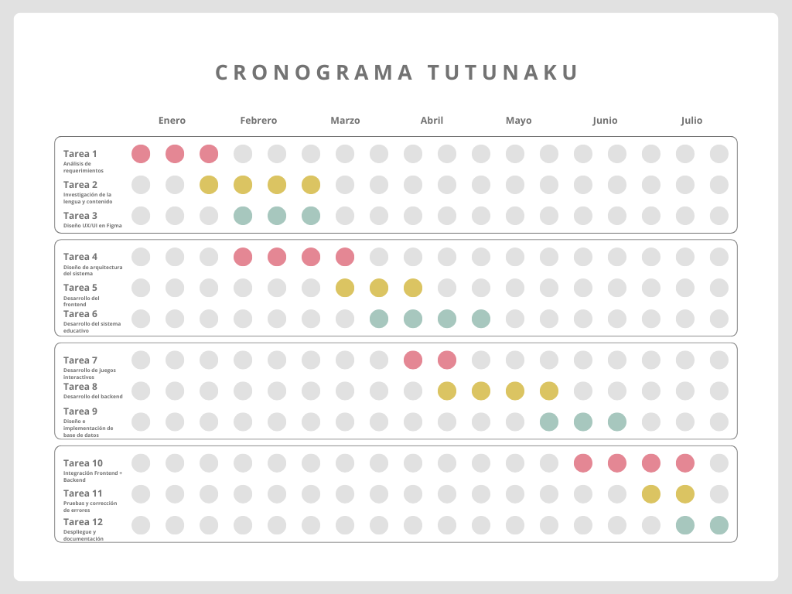
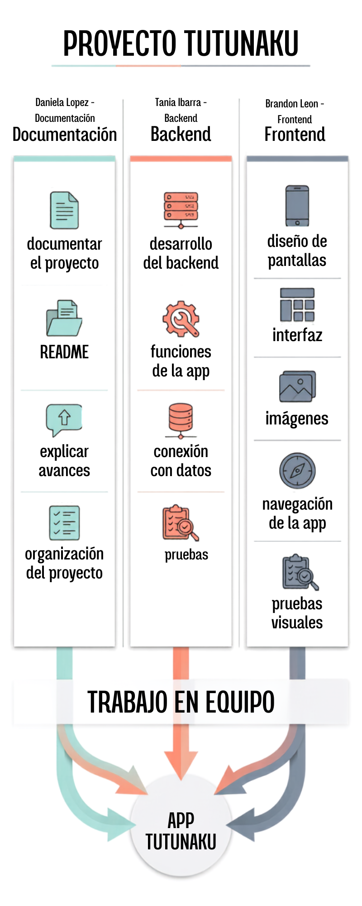
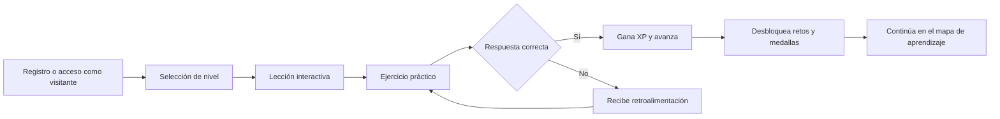
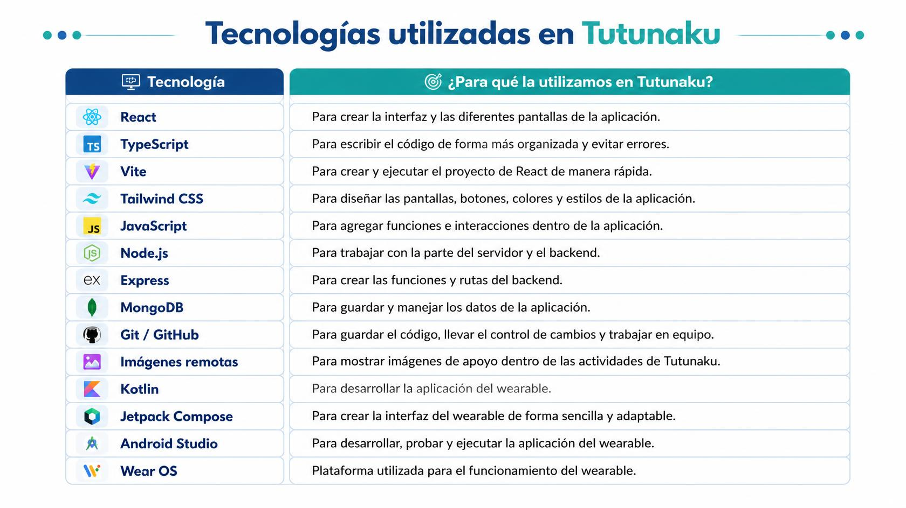
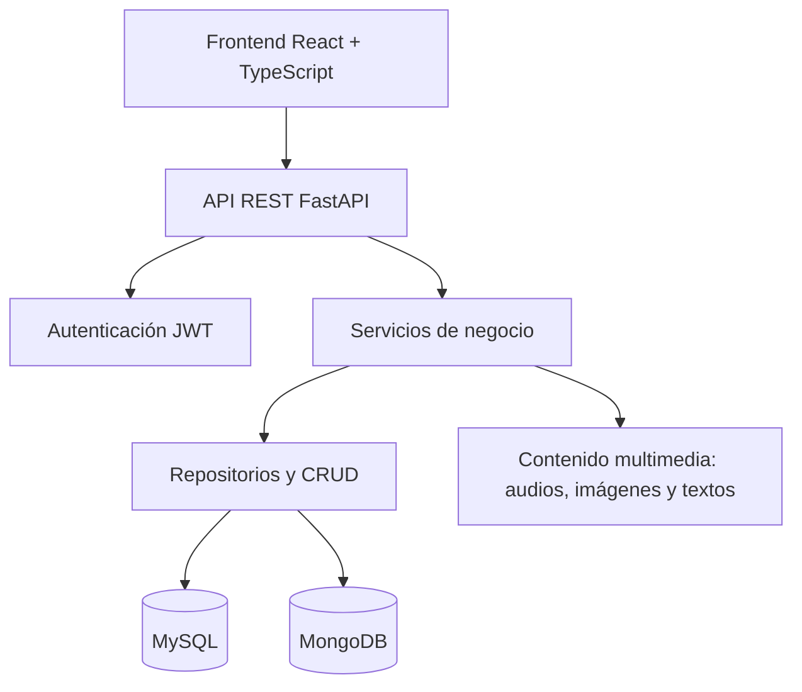

<div align="center">

# Tutunakun

<p align="center">
  
  &nbsp;&nbsp;&nbsp;&nbsp;
  
</p>

## Plataforma web gamificada para la enseñanza, rescate y difusión de la lengua totonaca

**Preservando la lengua totonaca, una lección a la vez.**

<br>


<br>
<br>


<br>
<br>

</div>
<div align="center">

---

## Descripcion del Proyecto

**Tutunakun** es una plataforma web gamificada orientada a la enseñanza, rescate y difusión de la lengua totonaca entre las nuevas generaciones.

El proyecto integra tecnología, cultura y educación mediante una experiencia interactiva que permite aprender vocabulario, expresiones clave, pronunciación, elementos culturales y variantes dialectales de la lengua totonaca, especialmente en la **Sierra Norte de Puebla** y la **Costa de Veracruz**.

La plataforma busca funcionar como un puente entre generaciones, comunidades, instituciones educativas y usuarios interesados en aprender desde cero, respetando la oralidad, la memoria y la identidad cultural de los pueblos totonacas.

---

## Equipo

| Integrante              | Participación                                              |
| ----------------------- | ----------------------------------------------------------- |
| Ana Daniela López Neri | Investigación, documentación y enfoque educativo          |
| Brandon Leon Cabrera    | Desarrollo, diseño técnico y estructura de plataforma     |
| Tania Ibarra Salgado    | Investigación, diseño UI/UX y documentación del proyecto |

---

## Problema Detectado

La lengua y cultura tutunaku corren el riesgo de perderse por la falta de difusión y herramientas accesibles.

Los métodos actuales suelen ser estáticos, como documentos PDF, listas de vocabulario o diccionarios pasivos. Esto impide que las nuevas generaciones y usuarios externos se interesen de manera constante por aprender la lengua y conocer la cultura.

Para confirmar este problema, el proyecto contempla la aplicación de encuestas que permitan conocer:

- El nivel de interés del público general.
- Qué tanto conocen la lengua y cultura tutunaku.
- Qué dinámicas prefieren para aprender.
- Qué elementos visuales e interactivos les resultan más atractivos.
- Qué tipo de retos, juegos o actividades les motivan a continuar aprendiendo.

---

## Definicion del Problema: Enfoque POV

| Elemento  | Definición                                                                                                      |
| --------- | ---------------------------------------------------------------------------------------------------------------- |
| Usuario   | Público general, estudiantes y nuevas generaciones interesadas en aprender la lengua tutunaku desde cero.       |
| Necesidad | Una plataforma accesible, interactiva y moderna para aprender y difundir la cultura tutunaku de forma atractiva. |
| Insight   | El tutunaku necesita un vehículo digital atractivo que conecte con los intereses reales de los usuarios.        |

---
## Cronograma 


---

## Diagrama de Tareas


---


## Encuesta del Proyecto

Como parte de la validación inicial, se diseñó una encuesta para conocer el interés, las preferencias y las necesidades de los posibles usuarios de la plataforma.

**Formulario:**
[Responder encuesta del proyecto Tutunakun](https://docs.google.com/forms/d/e/1FAIpQLSdicRk0w6cT0iBhZMhlynNwl5ut_20coAkLjtYrxkOgRmYfzg/viewform?usp=publish-editor)

---

## Objetivos

### Objetivo General

Implementar una plataforma web gamificada orientada a la enseñanza, rescate y difusión de la lengua totonaca entre las nuevas generaciones.

### Objetivos Específicos

| No. | Objetivo                                                                                                                                                                                                                                                  |
| --- | --------------------------------------------------------------------------------------------------------------------------------------------------------------------------------------------------------------------------------------------------------- |
| 1   | Investigar y recopilar variantes dialectales, vocabulario, expresiones clave y elementos culturales de la lengua totonaca en la Sierra Norte de Puebla y la Costa de Veracruz, en colaboración con hablantes nativos o instituciones educativas locales. |
| 2   | Diseñar el modelo pedagógico y de gamificación de la plataforma, definiendo dinámicas como puntos, niveles, medallas y retos que incentiven el interés y la retención del aprendizaje en usuarios jóvenes.                                         |
| 3   | Estructurar la interfaz de usuario y la experiencia de usuario mediante prototipos dinámicos, asegurando una navegación intuitiva, atractiva y adaptable a la población objetivo.                                                                      |
| 4   | Desarrollar la plataforma web integrando módulos de lecciones, sistema de recompensas gamificadas y una base de datos eficiente para almacenar contenidos multimedia como audios de pronunciación, imágenes y textos.                                  |
| 5   | Evaluar el impacto y funcionamiento de la plataforma mediante pruebas piloto con jóvenes de comunidades seleccionadas, con el fin de medir la usabilidad del sistema y el nivel de aceptación en el aprendizaje de la lengua totonaca.                  |

---

## Design Thinking

### Fase: Empatizar

En Design Thinking, empatizar para el proyecto **Tutunakun** significa sumergirse en el territorio para entender que la tecnología debe adaptarse a la cultura, y no al revés.

No diseñamos desde el aislamiento, sino desde el respeto a la memoria, la oralidad y la identidad de los pueblos totonacas.

### Hallazgo Empático

| Pilar                              | Descripción                                                                                                                                                                                                                                                                                      |
| ---------------------------------- | ------------------------------------------------------------------------------------------------------------------------------------------------------------------------------------------------------------------------------------------------------------------------------------------------- |
| Sanar la brecha intergeneracional  | Los abuelos temen la pérdida de su cosmovisión ante la falta de transmisión oral. Los jóvenes no rechazan su identidad, sino las herramientas estáticas como PDFs o diccionarios pasivos. Empatizar significa cambiar el vehículo, la tecnología, sin cambiar la esencia, el conocimiento. |
| Co-diseño y respeto a la oralidad | La plataforma se construye de forma horizontal con hablantes nativos. Se respetan variantes regionales y contextos culturales, almacenando datos vivos como audios reales, notas culturales e imágenes, no solo traducciones literales del español.                                             |
| Identidad como puente              | El concepto del Corazón Alebrije nace como una identidad visual vibrante y moderna, capaz de generar orgullo e inmersión en las nuevas generaciones.                                                                                                                                            |

---

## Propuesta de Valor

| Antes                                   | Con Tutunakun                                                        |
| --------------------------------------- | -------------------------------------------------------------------- |
| Materiales estáticos y poco atractivos | Lecciones interactivas y gamificadas                                 |
| Aprendizaje aislado                     | Experiencia guiada con progreso y recompensas                        |
| Poco acceso a pronunciación real       | Audios de hablantes nativos y notas culturales                       |
| Falta de conexión generacional         | Plataforma construida desde la oralidad y la colaboración           |
| Información dispersa                   | Base de datos organizada con vocabulario, imágenes, textos y audios |

---

## Caracteristicas Principales

| Módulo                  | Descripción                                                    |
| ------------------------ | --------------------------------------------------------------- |
| Lecciones interactivas   | Contenido organizado por niveles, temas y dificultad.           |
| Gamificación            | Puntos, niveles, medallas, corazones, rachas, retos y progreso. |
| Mapa de aprendizaje      | Ruta visual para avanzar de forma progresiva.                   |
| Contenido multimedia     | Audios de pronunciación, imágenes, textos y notas culturales. |
| Roles de usuario         | Administrador, usuario registrado y visitante.                  |
| Dashboard administrativo | Métricas de uso, avance, participación y contenidos.          |
| Recordatorios            | Sistema configurable para motivar la práctica diaria.          |
| Diseño responsive       | Interfaz adaptable para computadoras, tablets y celulares.      |
| Modo oscuro              | Experiencia visual cómoda y moderna.                           |
| Preparación i18n        | Base lista para soporte multilenguaje.                          |

---

## Modelo de Gamificacion

La plataforma utiliza elementos de juego para motivar el aprendizaje constante y la retención de conocimiento.

| Elemento  | Función dentro de la plataforma                          |
| --------- | --------------------------------------------------------- |
| XP        | Experiencia obtenida al completar lecciones y ejercicios. |
| Niveles   | Progreso del usuario dentro del mapa de aprendizaje.      |
| Corazones | Sistema de intentos o energía para resolver actividades. |
| Rachas    | Días consecutivos de práctica.                          |
| Medallas  | Recompensas por logros específicos.                      |
| Retos     | Actividades especiales para reforzar temas importantes.   |
| Ranking   | Comparación de avance entre usuarios.                    |
| Progreso  | Seguimiento individual de lecciones completadas.          |

---

## Flujo de Aprendizaje



---

## Stack Tecnologico

| Capa                 | Tecnología  | Uso principal                                          |
| -------------------- | ------------ | ------------------------------------------------------ |
| Frontend             | React 18     | Construcción de interfaz dinámica.                   |
| Lenguaje frontend    | TypeScript   | Tipado y mayor seguridad en el desarrollo.             |
| Build tool           | Vite         | Entorno rápido de desarrollo.                         |
| Estilos              | TailwindCSS  | Diseño responsivo y moderno.                          |
| Backend              | FastAPI      | API REST rápida y documentada.                        |
| Lenguaje backend     | Python 3.11  | Lógica de negocio y servicios.                        |
| Base relacional      | MySQL 8      | Usuarios, progreso, roles y relaciones.                |
| Base NoSQL           | MongoDB 7    | Contenido flexible, multimedia y variantes culturales. |
| Validación          | Pydantic v2  | Validación de datos y esquemas.                       |
| Autenticación       | JWT          | Access tokens y refresh tokens.                        |
| Documentación       | Swagger UI   | Documentación automática de endpoints.               |
| Control de versiones | Git y GitHub | Gestión del código fuente.                           |

<div align="center">

---

## Tecnologías utilizadas


---

## Arquitectura

El proyecto sigue una organización inspirada en **Clean Architecture**, separando responsabilidades para facilitar mantenimiento, escalabilidad y pruebas.



---

## Estructura del Proyecto

```bash
tutunakun/
├── frontend/              # React + TypeScript + Vite
│   ├── src/
│   │   ├── assets/        # Imágenes, sonidos y recursos visuales
│   │   ├── components/    # Componentes reutilizables
│   │   ├── pages/         # Vistas principales
│   │   ├── routes/        # Rutas del frontend
│   │   ├── services/      # Consumo de API
│   │   ├── hooks/         # Hooks personalizados
│   │   └── types/         # Tipos de TypeScript
│   ├── public/
│   └── package.json
│
├── backend/               # FastAPI + Python
│   ├── app/
│   │   ├── routes/        # Controladores HTTP
│   │   ├── services/      # Lógica de negocio
│   │   ├── models/        # Modelos de base de datos
│   │   ├── schemas/       # DTOs y validaciones
│   │   ├── crud/          # Acceso a datos
│   │   └── core/          # Configuración, auth y utilidades
│   └── requirements.txt
│
├── database/
│   ├── mysql/             # Scripts SQL
│   └── mongodb/           # Scripts y seeds MongoDB
│
├── docs/                  # Documentación, prototipos y evidencias
└── README.md
```

---

## Instalacion y Ejecucion

### Prerrequisitos

- Node.js 18 o superior.
- Python 3.11 o superior.
- MySQL 8 o superior.
- MongoDB 7 o superior.
- Git.

<details>
<summary>1. Ejecutar backend con FastAPI</summary>

```bash
cd backend

python -m venv venv

# Windows
venv\Scripts\activate

# Linux o macOS
source venv/bin/activate

pip install -r requirements.txt

cp .env.example .env

uvicorn app.main:app --reload --port 8000
```

La documentación de la API estará disponible en:

```bash
http://localhost:8000/docs
```

</details>

<details>
<summary>2. Configurar base de datos MySQL</summary>

```bash
mysql -u root -p

source database/mysql/schema.sql

source database/mysql/seeds.sql
```

</details>

<details>
<summary>3. Ejecutar frontend con React y Vite</summary>

```bash
cd frontend

npm install

cp .env.example .env.local

npm run dev
```

El frontend estará disponible en:

```bash
http://localhost:5173
```

</details>

---

## Variables de Entorno

### Backend

```env
APP_NAME=Tutunakun
APP_ENV=development
SECRET_KEY=change_this_secret
ACCESS_TOKEN_EXPIRE_MINUTES=30
REFRESH_TOKEN_EXPIRE_DAYS=7

DB_TYPE=mysql
MYSQL_HOST=localhost
MYSQL_PORT=3306
MYSQL_USER=root
MYSQL_PASSWORD=password
MYSQL_DATABASE=tutunakun

MONGO_URI=mongodb://localhost:27017
MONGO_DATABASE=tutunakun
```

### Frontend

```env
VITE_API_URL=http://localhost:8000/api/v1
VITE_APP_NAME=Tutunakun
```

---

## Base de Datos

Tutunakun está preparado para dos enfoques de almacenamiento:

| Opción | Uso recomendado                                                                          |
| ------- | ---------------------------------------------------------------------------------------- |
| MySQL   | Usuarios, roles, progreso, lecciones, cursos, recompensas y relaciones.                  |
| MongoDB | Vocabulario flexible, variantes dialectales, contenido multimedia y recursos culturales. |

Para cambiar entre bases de datos, ajusta la variable:

```env
DB_TYPE=mysql
```

o

```env
DB_TYPE=mongodb
```

---

## Roles del Sistema

| Rol                | Descripción                                                       |
| ------------------ | ------------------------------------------------------------------ |
| Administrador      | Gestiona usuarios, lecciones, contenidos, recompensas y métricas. |
| Usuario registrado | Aprende, guarda su progreso, gana recompensas y completa retos.    |
| Visitante          | Explora contenido básico sin necesidad de registrarse.            |

---

## Credenciales de Prueba

| Rol           | Email              | Contraseña |
| ------------- | ------------------ | ----------- |
| Administrador | admin@tutunakun.mx | Admin1234!  |
| Usuario       | demo@tutunakun.mx  | Demo1234!   |

---

## Endpoints Principales

| Método | Ruta                               | Descripción                      |
| ------- | ---------------------------------- | --------------------------------- |
| POST    | `/api/v1/auth/register`          | Registro de usuario.              |
| POST    | `/api/v1/auth/login`             | Inicio de sesión.                |
| POST    | `/api/v1/auth/refresh`           | Renovación de token.             |
| GET     | `/api/v1/courses`                | Listar cursos disponibles.        |
| GET     | `/api/v1/lessons/{id}`           | Obtener detalle de una lección.  |
| POST    | `/api/v1/exercises/{id}/attempt` | Enviar respuesta de un ejercicio. |
| GET     | `/api/v1/users/me/progress`      | Consultar progreso del usuario.   |
| GET     | `/api/v1/admin/metrics`          | Consultar métricas globales.     |

---

## Contenido Educativo

La plataforma contempla:

- Vocabulario básico.
- Expresiones cotidianas.
- Frases culturales.
- Audios de pronunciación.
- Imágenes representativas.
- Notas culturales.
- Variantes dialectales.
- Ejercicios interactivos.
- Retos de memoria, selección y pronunciación.
- Lecciones organizadas por niveles de dificultad.

---

## Mascota del Proyecto

### Corazón Alebrije

El **Corazón Alebrije** es la mascota principal de Tutunakun.

Representa el amor por la cultura, la energía del aprendizaje y la identidad visual mexicana. Su diseño combina un corazón caricaturizado con patrones inspirados en alebrijes, creando una imagen moderna, colorida y cercana para los jóvenes.

---

## Evaluacion del Proyecto

La plataforma será evaluada mediante pruebas piloto con jóvenes de comunidades seleccionadas.

| Aspecto                  | Forma de evaluación                                       |
| ------------------------ | ---------------------------------------------------------- |
| Usabilidad               | Pruebas de navegación y encuestas de experiencia.         |
| Interés                 | Nivel de participación en lecciones y retos.              |
| Aprendizaje              | Resultados en ejercicios y avance por niveles.             |
| Aceptación              | Opinión de los usuarios sobre la plataforma.              |
| Representación cultural | Validación con hablantes nativos e instituciones locales. |

---

## Indicadores Esperados

| Indicador      | Resultado esperado                                 |
| -------------- | -------------------------------------------------- |
| Usabilidad     | Navegación clara e intuitiva.                     |
| Aprendizaje    | Mayor retención mediante actividades gamificadas. |
| Participación | Incremento del interés por la lengua tutunaku.    |
| Identidad      | Mayor orgullo y reconocimiento cultural.           |
| Accesibilidad  | Uso adecuado en dispositivos móviles.             |

---

## Roadmap

| Fase            | Estado     | Actividades                                                   |
| --------------- | ---------- | ------------------------------------------------------------- |
| Investigación  | En proceso | Encuestas, análisis cultural y recopilación de vocabulario. |
| Diseño UI/UX   | En proceso | Prototipos, experiencia de usuario y diseño visual.          |
| Gamificación   | En proceso | Definición de XP, niveles, retos, medallas y recompensas.    |
| Backend         | Planeado   | API, autenticación, servicios y base de datos.               |
| Frontend        | Planeado   | Módulos de lecciones, mapa de niveles y dashboard.           |
| Pruebas piloto  | Planeado   | Validación con jóvenes y usuarios externos.                 |
| Mejora continua | Planeado   | Ajustes con base en resultados de encuestas y pruebas.        |

---

## Colaboracion Comunitaria

Este proyecto reconoce la importancia de trabajar junto a:

- Hablantes nativos.
- Docentes.
- Instituciones educativas.
- Jóvenes de comunidades totonacas.
- Investigadores culturales.
- Usuarios interesados en preservar la lengua.

Tutunakun busca respetar la oralidad, las variantes regionales y la identidad cultural de las comunidades.

---

## Como Contribuir

```bash
# Clonar el repositorio
git clone https://github.com/usuario/tutunakun.git

# Crear una rama
git checkout -b feature/nueva-funcionalidad

# Guardar cambios
git add .

# Crear commit
git commit -m "Agrega nueva funcionalidad"

# Subir rama
git push origin feature/nueva-funcionalidad
```

Después, crea un Pull Request explicando los cambios realizados.

---

<div align="center">
